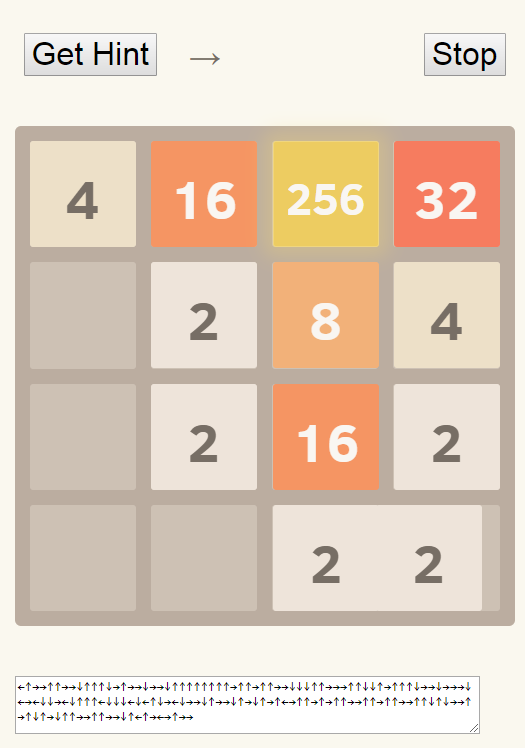

# 2048 AI

AI for the game [2048](https://github.com/gabrielecirulli/2048).

Forked from [ovolve/2048-AI](https://github.com/ovolve/2048-AI) excellent work.

I just added keypress display to analyse what the AI is doing and find patterns...

